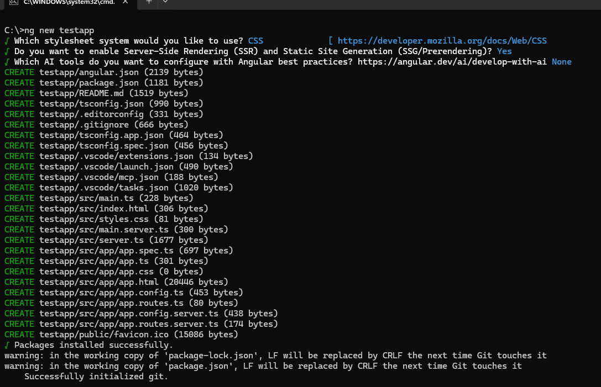
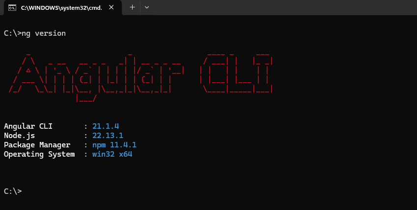
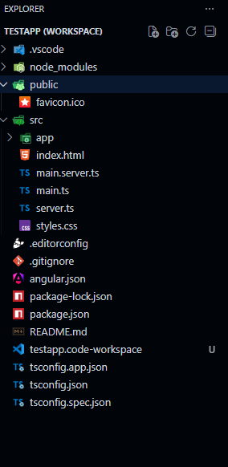
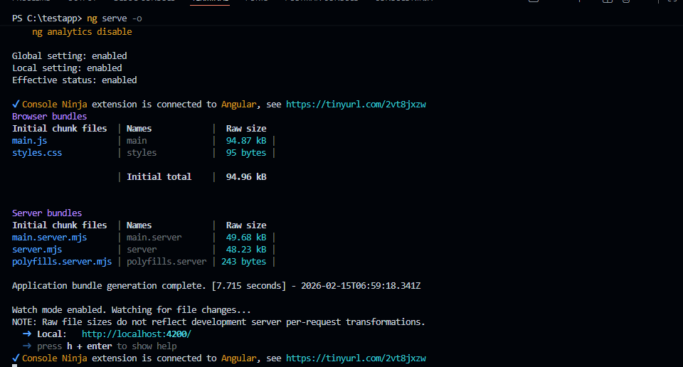
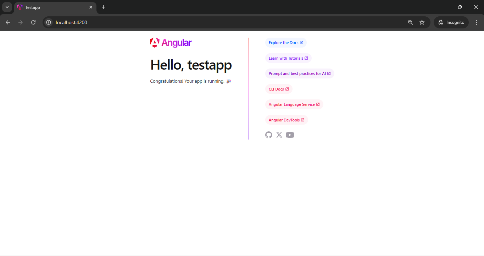

**ACTIVITY 2: Angular Tools And First App**

**Author:** ADEWALE OLAOMO  
**Date:** 22 Feb 2026

**INTRODUCTION**

This activity involved installing Angular Development Tools (also known
as the Angular CLI), confirming that the Angular Framework was installed
correctly and that I could create an actual Angular Project, gaining
understanding about how to use the Angular CLI (Command Line Interface)
development environment and the basic folder structure of an Angular
Project, and how an Angular Application is built and shown in a Web
Browser.

I was able to successfully install the Angular CLI and then build a Test
Application for this Assignment/work.I successfully installed the
Angular CLI, then created a Test Application, and then displayed my Test
Application via a Web Browser. I also altered the values of Component
Properties/Variables in my Test Application, and I examined & explored
the contents of the Folder Structure that was created by the Angular CLI
for my Test Application, including the major configuration files for the
Angular CLI and the manner in which Angular will display a Final Web
Page/Enable/Implement/viewing (or see) the Updated Version of the Web
Page when Angular is generated.

**Activity 2 Code Git URL:**

https://github.com/whaleswqeb/Topic_2_Activity-2_code

**TOOL INSTALLATION**

**Installing Angular CLI**

I started this process by using **npm** to globally install Angular CLI.
Angular CLI is the command line interface for creating and configuring
Angular Projects along with developing them.

The following command was executed:

npm install -g @angular/cli

After Installation, I verified the installation using :

ng version

Using this command showed me what version of Angular CLI was installed
along with what versions of node.js and other packages were installed.

**Angular CLI version verification after installation.**

This confirmed that Angular was successfully installed and properly
configured in the development environment.

**CREATING THE TEST APPLICATION**

I created a new Angular project using the Angular CLI Command

ng new testapp

When creating a project:

1.  I answered Yes to the question of whether or not to use Angular
    Routing.

2.  I chose CSS as my stylesheet format.

    The Angular CLI created a full project structure, which contained
    all configuration files, dependencies and starter components,
    automatically.

    

**Angular test application created successfully.**

In this step I verified that the Angular environment was operating
correctly.

**OPENING PROJECT IN VS CODE**

I opened Visual Studio Code after creating a new project from the
project directory. By creating and saving the workspace.

I can access (i.e., edit) project files,

edit the application's various components in the integrated terminal,

observe the automatic reloading of the browser (live reload), etc.

**Test application opened in Visual Studio Code workspace.**

**RUNNING THE APPLICATION**

To start the development server, execute below command:

ng serve -o

This command:

- Compiled the Angular project

- Started a local development server

- Opened the browser automatically at <http://localhost:4200>

  

**Default Angular application running successfully in browser.**

This confirmed that the Angular application was successfully compiled
and rendered.

# MODIFYING COMPONENT VARIABLES

In app.ts, I changed the title variable from :

title = 'testapp';

To :

title = 'My First Angular Application';

After saving the file, the browser automatically refreshed and displayed
the updated title.

**Updated title variable reflected automatically in browser.**

This demonstrated Angular’s live reload capability and data binding
feature.

**ADDING NEW CLASS MEMBER VARIABLE**

I added new variables in the app.ts

message = 'Build Using TypeScript';

Then, I displayed it in **app.html** using Angular interpolation syntax:

 \<p\>{{message()}}\</p\>

After saving the file, the browser updated automatically.

**New class member variable rendered in component template.**

# PROJECT STRUCTURE EXPLANATION

Angular Folder Structure

1\. node_modules

- Holds all of the necessary third-party packages/dependencies needed
  for the Angular application. These are automatically installed via npm
  and include core Angular libraries and other necessary modules.

  2\. src

- The main source folder of the application. Contains all code related
  to the application.

  3\. src/app

- This is where all components, modules and logic files of the main
  application reside:

1.  app.component.ts

2.  app.component.html

3.  app.component.css

4.  app.module.ts

    4\. src/assets

- Where static files (e.g. images, fonts, etc.) used by application will
  be kept.

  5\. src/environments

- Contains the environment configuration files:

- environment.ts (for development)

- environment.prod.ts (for production)

- To provide the ability to configure functionality based on the
  environment.

**CONFIGURATION FILES**

## Important Configuration Files

### angular.json

- This file contains project configuration details such as:

1.  Build settings

2.  Assets configuration

3.  Style and script references

4.  Development server configuration

- It acts as the main configuration file for Angular CLI.

### package.json

- This file defines:

1.  Project dependencies

2.  Development dependencies

3.  Project scripts

4.  Project metadata

- It allows npm to manage required packages.

### tsconfig.json

- This file configures the TypeScript compiler. It defines:

1.  Compilation settings

2.  Target ECMAScript version

3.  Module resolution

4.  Strict type checking options

    **HOW ANGULAR GENERATES THE PAGE**

**Generating an Angular Page**

When ng serve executes, Angular takes the following steps:

1\. Main.ts

- **Main.ts** will bootstrap or load the application's root module
  (**AppModule**).

2\. App.Module.ts

- **App.Module.ts** is the root module of the Angular app that declares
  and imports all the components/modules needed for the app to run and
  it instructs Angular which component to run when the application is
  loaded.

3\. App.Component.ts

- **App.Component.ts** contains all of the logic for the root component
  of the application. This is where all of the variables and
  functionality are defined.

4\. App.Component.html

- **App.Component.html** contains the HTML template (view) used to
  display the root component in the user's browser.

5\. App.Component.css

- **App.Component.css** contains the styles defined specifically for
  this component.

Once the above files are compiled into JavaScript bundles, Angular will
inject them (dynamically) into **index.html**, where they are referenced
by the element in **index.html** to render the application's root
component on the user's browser.

**Research:**

1.  Inspect the default test project structure created in the Activity.
    Describe the purpose for each of the folders of the following in the
    project structure: node_modules, src, src/app, src/assets, and
    src/environments. Also, describe the purpose for each of the
    following files in the project: angular.json, package.json, and
    tsconfig.json,

**Ans:**

In this activity I have created testapp using angular CLI which I use
for generating new angular project.while installing the project I
thought first, it was somewhat overwhelming, but after I spent some time
looking into the purpose of the different folders and files, I began to
understand how each of those useful for the overall Angular application
would function.

When I install a package using npm, these tools download the package
along with its dependencies and save them in the node_modules folder.
This folder ensures that all required dependencies are available for the
project to run successfully.The **node_modules folder** is a directory
in Node.js projects that stores third-party libraries and dependencies.

The source **/src** folder is where all of the core application code is
kept, this includes everything necessary for building your application
including component code, styling code, and application logic code
etc... So essentially it holds all of the elements required to build-out
the app.

Inside this **src/app** folder we see the main root component and app.ts
entry point class of our application. Most of the code I write and the
components I create will be within this folder.

Inside this **src/assets** folder I kept require static files, such as
images or icons. If we wanted to add a logo or another image to the app,
we would place that here.

Environment settings are in the **src/environments** folder and used to
set different settings, such as different api urls; for example,
development and production.

The root of the project contains important configuration files.

The **angular.json** file is responsible for controlling how the
project is built and served. In addition, it specifies the build
settings and other configuration details.

**Package_json** this files holds all the required dependencies with the
version

It helpful when someone run the npm install command it loads the
required dependencies mentioned in the file.

The **tsconfig.json** file holds the configuration setting for the
Typescript compiler. It tells Typescript how to convert from the
Typescript code to Javascript code.

2.  Inspect the page source for the default page displayed when running
    the test project. Explain how the resultant page was generated by
    Angular by providing a brief overview and purpose for each of the
    following files: main.ts, app.component.css, app.component.html,
    app.component.ts, and app.module.ts.

    **ans**

    The test Angular application returned a lot of completed code.
    However, the other application returned just the files that had been
    written with all of the code combined and compiled into JavaScript
    files, indicating that Angular doesn't send the raw
    TypeScript/component files to the browser directly; rather, it
    compiles and generates everything on the server before sending it to
    your browser.

    The **main.ts** is the main entry of my app. This is the first file
    which executed when we run the application. The purpose of this file
    is to bootstrap (or start) the application’s main module –
    AppModule. In other words, main.ts contains the information for
    Angular as to what the application will start at.

    Let’s move on to **app.module.ts**. This file is basically the heart
    of our app. It pulls everything together every part of our
    application connects here, we’ll find a list of all our components.
    This is also where you pick which one loads up first. Normally, it’s
    AppComponent—so that’s the one we see when we run up the app.

    Another file is **app.component.ts:** the main purpose of this file
    is to stores the main components logic in Angular, I have
    app.component.ts that defines any variables we want to display
    (title and any other data), as well as metadata (the template file,
    stylesheets and/or selectors). When Angular runs this component,
    Angular uses the app.component.ts file to determine how to run this
    component.

    **app.component.html** in this file we have to write html code and
    it uses angular feature like interpolation and mainly which use to
    combine the data from the app.component.ts with this HTML template
    to render the data on the browsers.

    \*\*\*\*

**CONCLUSION**

Setting up an Angular development environment through this activity gave
me valuable, hands-on experience. I successfully downloaded Angular CLI,
created a sample app, started a dev server, and modified component
properties. Additionally, I analyzed Angular core configuration and
structural files.

The research portion of this project allowed me to better understand the
Angular compilation of typescript files, module bootstrapping, and
dynamic rendering on a web page. Overall, I developed a solid
understanding of developing Angular applications as well as the
architecture behind Angular projects.
