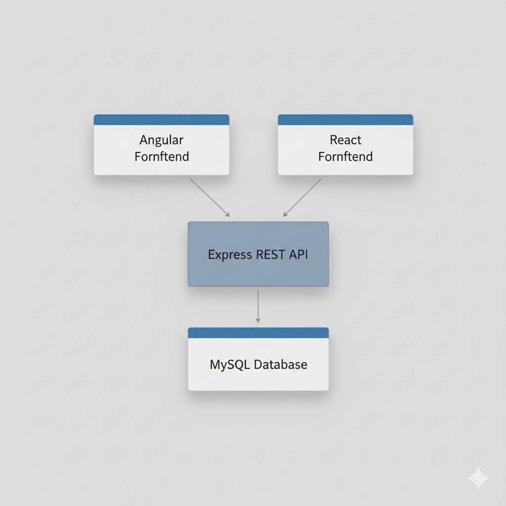
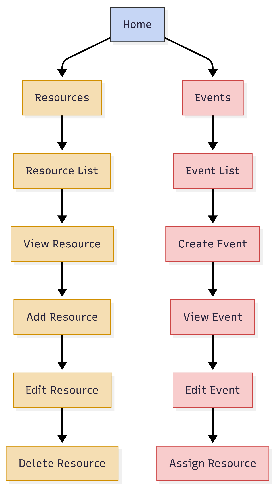
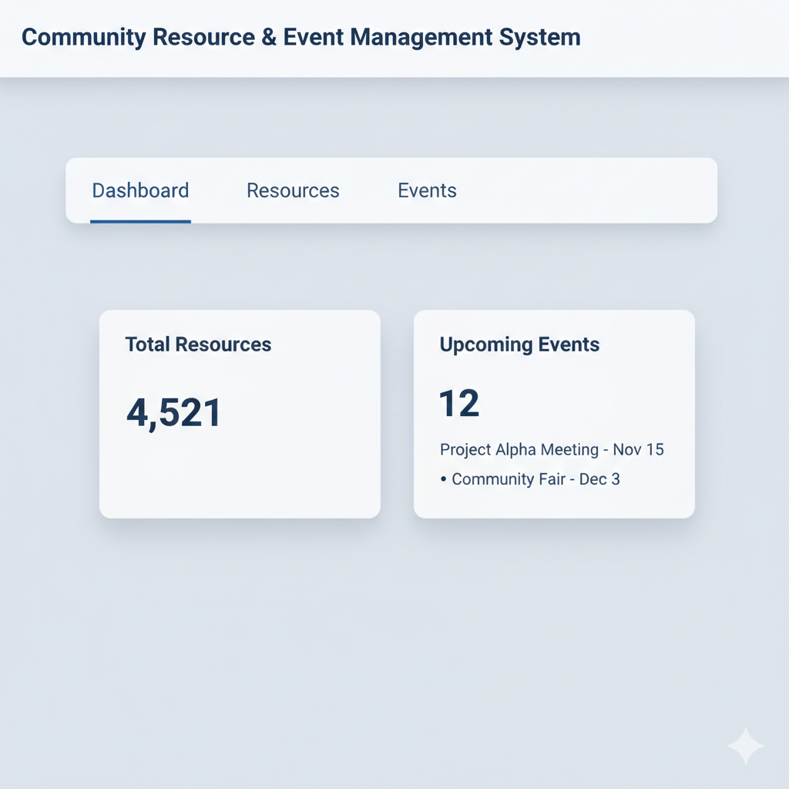
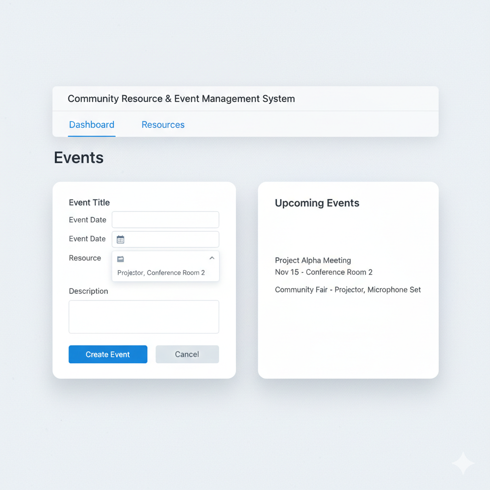
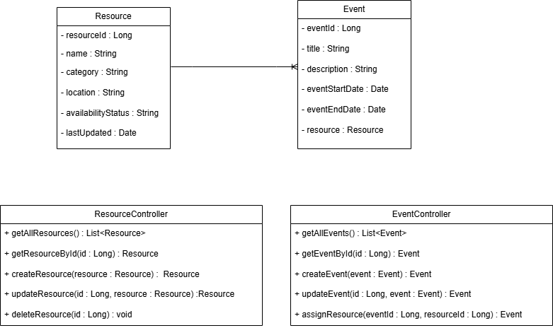

**Milestone 2: Refined Project Proposal**

**Course:** JavaScript Web Application Development  
**Application Name:** Community Resource & Event Management System  
**Author:** ADEWALE OLAOMO  
**Date:** 22 Feb 2026

# **Project Proposal**

---

## **Introduction**

The Community Resource & Event Management System is a web application
that helps churches, non profits, student groups and local clubs keep
track of shared items plus plan gatherings. Small groups often use paper
lists or spreadsheets, a practice that produces double bookings, hidden
shortages and last minute chaos.
The system gathers every item in one place - rooms, chairs, sound gear,
books or digital files. Any approved person sees what is free, reserves
it but also links it to a meeting, class or party. A single calendar and
a single list of owners show who has what as well as when it will be
returned.

The server runs on Node.js with Express and stores data in MySQL. Two
separate browser clients will be written - one with Angular, one with
React. Both clients call the same REST endpoints or offer the same
screens and rules - the team can measure Angular against React without
changing the logic or the data.

## **Domain and Products Managed by the Application**

The primary domain of the application is the management of community
resource and event management. The primary product of the application is
the Resource, which may be anything the organization owns or shares.

Examples of the resource include:  
o Meeting rooms  
o Projectors and audio equipment  
o Books and other study materials  
o Sports and event equipment  
o Digital equipment

Besides the resource, the application also manages the concept of
Events, which may be anything the community wants to do, like a meeting,
workshop, prayer, or even training.
The application is simple, practical, and realistic. It avoids the
complexity of enterprise software.

## **Functionality Requirements (User Stories)**

### **Resource Management**
As a user, I want to:  
1.View a list of all resources (so I know what's available).  
2.View detailed information about a resource (so I understand its status and where it's located).  
3.Add new resources (so they can be tracked in the system).  
4.Update the resource details (so the information stays accurate).  
5.Delete a resource that is not being used anymore.

### **Event Management**

To help our users:

1.To attach an event to the community, we want the capability to add events to a calendar of organized events  
2.To have a clear view of what events are coming up  
3.To create schedules for resources being used and identify potential conflicts
4.To make changes to scheduled events as they change

### **System Requirements**

1.I would like to check any incoming data for errors before I save it,
so I do not store any bad data.  
2.I intend to create a way to save data to a database that is a
relational database system.  
3.I will create a means of allowing both my angular application and my
react application to access my backend system via a RESTful style
API.

## **Frameworks, Technologies, and Tools**

### **Backend**

- Node.js
- Express.js
- RESTful API architecture

### **Frontend**

- Angular (one client application)
- React (second client application)
- HTML, CSS, and TypeScript / JavaScript

### **Database**

- MySQL
- Relational schema with primary and foreign keys

### **Development Tools**

- Visual Studio Code
- Git and GitHub for version control
- Postman for API testing

### **System Architecture**



## **Initial UI Sitemap**



## **Initial UI Wireframes**

### **Dashboard Page**



###

###

###

###

###

###

###

###

### **Add / Edit Resource Page**


###

### **Event Management Page**



## **Initial Database Design (ER Diagram)**

### **ER Diagram**

###

### 

###

###

###

### **Relationships**

- One Resource can be assigned to multiple Events.
- Each Event references one Resource.

## **Initial UML Class Diagram**

### **UML**



## **General Technical Approach**

The application will follow a layered architecture:

### **Presentation Layer**

- Angular and React front-end applications
- Forms and tables for user interaction
- REST API consumption

### **Business Layer**

- Express controllers and services
- Validation and business rules
- Resource availability checks

### **Persistence Layer**

- MySQL database
- DAO-style database access
- Relational schema with foreign keys

This architecture ensures separation of concerns, scalability, and
maintainability.

---

# REST API Design

The API strictly follows REST architectural conventions and best practices:

- **Plural nouns represent resources**
- **URLs follow a hierarchical structure**
- **HTTP verbs represent actions**
- **No verbs are used in endpoint paths**
- A consistent base URL is used for all endpoints

---

## Base URL

```
/api
```

---

# Resource API Endpoints

| Method | Endpoint                               | Description                             |
| ------ | -------------------------------------- | --------------------------------------- |
| GET    | `/api/resources`                       | Retrieve all resources                  |
| GET    | `/api/resources?resourceId=1`          | Retrieve a specific resource by ID      |
| POST   | `/api/resources`                       | Create a new resource                   |
| PUT    | `/api/resources`                       | Update an existing resource             |
| DELETE | `/api/resources/{id}`                  | Delete a resource by ID                 |
| GET    | `/api/resources/search/name/{keyword}` | Search resources by name                |
| GET    | `/api/resources/category/{category}`   | Filter resources by category            |
| GET    | `/api/resources/availability/{status}` | Filter resources by availability status |

---

# Event API Endpoints

| Method | Endpoint                             | Description                                         |
| ------ | ------------------------------------ | --------------------------------------------------- |
| GET    | `/api/events`                        | Retrieve all events                                 |
| GET    | `/api/events?eventId=1`              | Retrieve a specific event by ID                     |
| POST   | `/api/events`                        | Create a new event                                  |
| PUT    | `/api/events`                        | Update an existing event                            |
| DELETE | `/api/events/{id}`                   | Delete an event by ID                               |
| GET    | `/api/events/search/title/{keyword}` | Search events by title                              |
| GET    | `/api/events/date/{date}`            | Filter events by date                               |
| GET    | `/api/events/resource/{resourceId}`  | Retrieve events associated with a specific resource |

---

# REST Compliance Justification

## 1. Plural Resources

All endpoints use plural nouns to represent collections of resources  
- `/resources`
- `/events`

This aligns with RESTful naming conventions.

---

## 2. Hierarchical Structure

The API structure becomes more specific as the path deepens:

```
/events/resource/{resourceId}
```

This clearly represents events filtered by a related resource, maintaining logical hierarchy.

---

## 3. HTTP Verbs Usage

The system uses HTTP methods to define actions instead of including verbs in the URL:

- **GET** → Retrieve data
- **POST** → Create new data
- **PUT** → Update existing data
- **DELETE** → Remove data

## This ensures clarity, standardization, and adherence to REST principles.

# Image Handling Strategy

Instead of storing image files directly in the database, the system stores image URLs retrieved from Unsplash.
This approach offers several advantages:

- Reduces database storage requirements
- Improves overall performance
- Simplifies backend implementation
- Allows direct frontend rendering using ``

## By storing only the image URL, the system remains lightweight and scalable.

# Conclusion
The backend structure of the **Community Resource & Event Management System** has been developed as a scalable solution for providing common services to handle resource sharing and schedule events.
The new design enhances the adherence to REST principles by defining plural naming conventions for resources, creating hierarchical URLs, and defining proper HTTP verbs. The API endpoints are now clearly defined with their associated data and through the proper use of normalized data in the database design.
